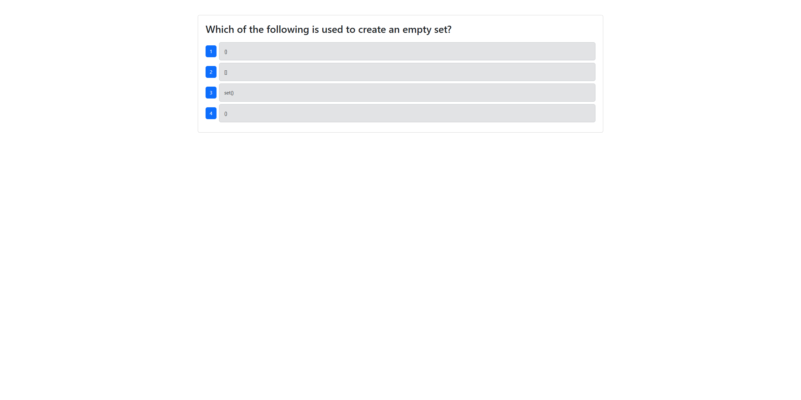
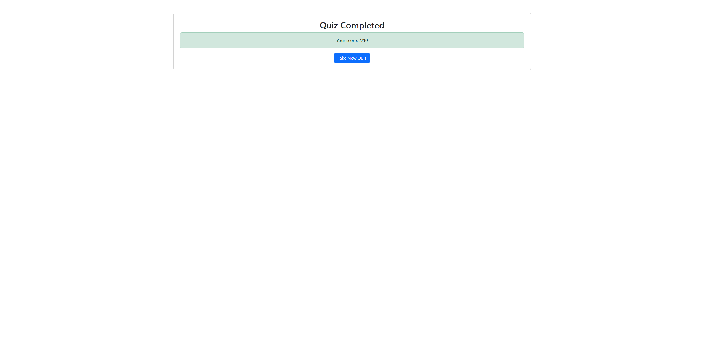

  # CI+CD-Pipeline-GitHub-Actions

  ## Description

  This is a simple online quiz, used as a platform for ensuring proper use of GitHub actions as a CI/CD pipeline tool. It runs tests when merging into develop and then deploys automatically when a new pull request is made to main

  # Table of Contents
  1. [Description](#description)
  2. [Installation](#installation)
  3. [Usage](#usage)
  4. [License](#license)
  5. [Contributing](#contributing)
  6. [Tests](#tests)
  7. [Questions](#questions)

  ## Installation

  You can fork and download the repo to test the github actions for yourself.

  ## Usage

  [Visit the site here!!!](https://cicd-pipeline-github-actions.onrender.com)  
  Using the project is as simple as starting the test and then answering each question, you'll get the number right out of 10 reported at the end. If you wish to use it for CI/CD practice. First, make a github repository, and setup the code here. Second, deploy that to Render or other hosting site and connect the DB. Third, take the deploy hook URL from the hosting site and add it ass an actions environment secret in your GitHub repo. Fourth, make a commit on a feature branch, merge it into a develop branch to see the tests run, then merge develop into main to watch as it automatically deploys.

    

  

  ## License

  This project uses the [MIT License](https://opensource.org/licenses/MIT) license. Click the link to learn more.

  ## Contributing

  No contributing---

  ## Tests

  Make a pull request into the develop branch of your GitHub repo and a component test will start automatically, run '''npm test''' with the server running to test in cypress locally

  ## Questions

  My GitHub:

  [BlazeEMP](https://www.github.com/BlazeEMP)

  My E-mail:

  BlazeLitAnui@gmail.com

  To reach me with further questions, email me here